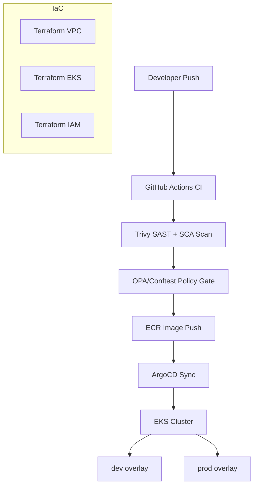

<p align="center"></p>

<div align="center">

# Fintech DevSecOps Pipeline

[](https://github.com/shaikn6/fintech-devsecops-pipeline/actions)
[](https://terraform.io)
[](https://kubernetes.io)
[](LICENSE)
[](https://argoproj.github.io/cd/)

**Production-grade DevSecOps pipeline for fintech — Terraform + EKS + ArgoCD + OPA policy enforcement**

</div>

## Architecture



## Key Components

| Component | Technology | Purpose |
|-----------|-----------|---------|
| CI/CD | GitHub Actions | Lint → scan → deploy |
| Security scanning | Trivy + Bandit | SAST + SCA |
| Policy enforcement | OPA + Conftest | Kubernetes admission |
| Infrastructure | Terraform | VPC, EKS, IAM, ECR |
| GitOps | ArgoCD | App delivery |
| Compliance | Custom scan | SOC2 / PCI controls |

## Quick Start

```bash
git clone https://github.com/shaikn6/fintech-devsecops-pipeline
cd fintech-devsecops-pipeline && cp .env.example .env

# Provision infrastructure
cd terraform/environments/dev
terraform init && terraform apply

# ArgoCD bootstrap
kubectl apply -f k8s/argocd/
```

## Directory Structure

```
├── .github/workflows/    # CI security, CD deploy, compliance scan
├── k8s/                  # Kustomize base + dev/prod overlays + ArgoCD apps
├── policies/             # OPA Rego policies + Conftest tests
├── terraform/            # VPC, EKS, IAM, ECR modules
└── scripts/              # Utility scripts
```

## License

MIT
