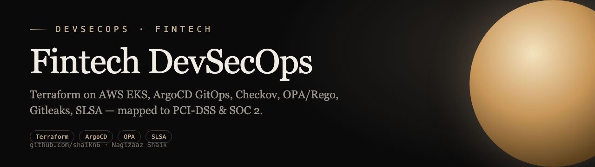
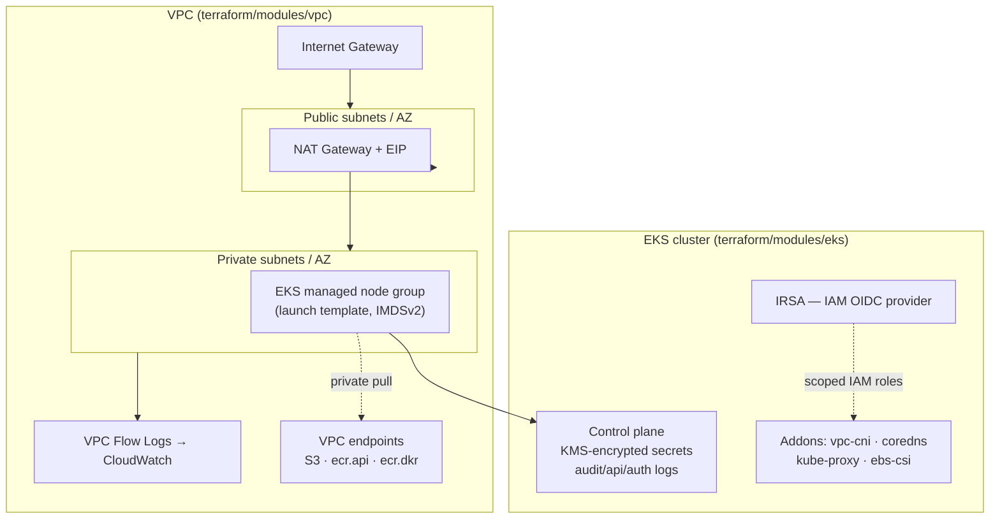

<p align="center"></p>

<div align="center">

# Fintech DevSecOps Pipeline

[](https://github.com/shaikn6/fintech-devsecops-pipeline/actions)
[](https://terraform.io)
[](https://kubernetes.io)
[](LICENSE)
[](https://argoproj.github.io/cd/)

**Shift-left DevSecOps reference platform for fintech workloads — hardened Terraform (VPC + private EKS with IRSA), an OPA/Rego admission policy set, a multi-scanner CI security gate, SLSA build provenance, and ArgoCD GitOps delivery.**

</div>

## Architecture

Two views of what the repo actually defines: the AWS network/compute topology
(Terraform `vpc` + `eks` modules) and the DevSecOps pipeline stage gates
(`.github/workflows` + `argocd/`).

### Infrastructure topology (Terraform)



### DevSecOps stage gates (CI/CD)

```mermaid
flowchart LR
    DEV[Developer push / PR] --> CI

    subgraph CI["Security Pipeline — ci-security.yml"]
        direction TB
        TF["terraform fmt + validate<br/>(hard gate)"]
        HELM["helm lint + template<br/>(hard gate)"]
        CKV[Checkov IaC scan]
        OPA["OPA / Rego check<br/>policies/rego"]
        GL[Gitleaks secret scan]
    end

    CI --> SUM[Compliance summary]
    SUM --> SLSA["SLSA L3 provenance<br/>cosign-signed attestation"]
    SLSA --> GATE{Manual deploy gate<br/>cd-deploy.yml}
    GATE --> ARGODEV["ArgoCD sync → EKS dev<br/>helm/fintech-api"]
    ARGODEV --> ITEST[Integration tests]
    ITEST --> APPROVE{Prod approval}
    APPROVE --> ARGOPROD[ArgoCD sync → EKS prod]

    WEEKLY["Weekly compliance scan<br/>(cron) — Trivy fs/config,<br/>pip-audit SBOM, CIS-K8s,<br/>tfsec → report + issue"] -.-> CI
```



## Key Components

| Component | Technology | What's in the repo |
|-----------|-----------|--------------------|
| Network | Terraform `vpc` module | VPC, public/private subnets per AZ, NAT, IGW, flow logs, S3 + ECR VPC endpoints |
| Compute | Terraform `eks` module | Private EKS control plane (KMS-encrypted secrets, audit logging), managed node group, IRSA OIDC provider, vpc-cni/coredns/kube-proxy/ebs-csi addons |
| CI security gate | GitHub Actions (`ci-security.yml`) | terraform fmt/validate, helm lint/template, Checkov, OPA/Rego, Gitleaks |
| Admission policy | OPA / Rego (`policies/rego`) | Container security, image signing, network-policy `deny` rules |
| Supply chain | SLSA + cosign (`slsa/build-provenance.yaml`) | SLSA Level 3 signed build provenance |
| Compliance | Scheduled scan (`compliance-scan.yml` + `scripts/compliance_reporter.py`) | Weekly Trivy/tfsec/pip-audit/CIS-K8s sweep → HTML+JSON report, auto-issue on critical findings |
| GitOps | ArgoCD (`argocd/`) | Self-healing app + AppProject, prune + auto-sync to EKS |
| Delivery artifact | Helm (`helm/fintech-api`) | Deployment, service, ingress, HPA, NetworkPolicy, configmap |

## Quick Start

```bash
git clone https://github.com/shaikn6/fintech-devsecops-pipeline
cd fintech-devsecops-pipeline && cp .env.example .env

# Validate the Terraform modules (no backend / no credentials needed)
terraform fmt -check -recursive
for d in terraform/modules/*/; do
  terraform -chdir="$d" init -backend=false && terraform -chdir="$d" validate
done

# Lint + render the Helm chart
helm lint helm/fintech-api
helm template fintech-api helm/fintech-api

# Check the OPA/Rego admission policies
opa check policies/rego

# Register the GitOps application (requires an ArgoCD-managed cluster)
kubectl apply -f argocd/projects/fintech-project.yaml
kubectl apply -f argocd/apps/fintech-app.yaml
```

> The `eks`/`vpc` modules are consumed by a root configuration that supplies a
> backend and AWS credentials; the commands above run the same validation,
> linting, and policy gates the CI security pipeline enforces, fully offline.

## Directory Structure

```
├── .github/workflows/    # ci-security, cd-deploy, compliance-scan
├── terraform/modules/    # vpc, eks (cluster + IRSA + addons)
├── helm/fintech-api/     # Helm chart: deployment, svc, ingress, hpa, netpol
├── argocd/               # ArgoCD Application + AppProject (GitOps)
├── policies/rego/        # OPA admission policies (container, image, network)
├── slsa/                 # SLSA L3 build-provenance workflow
├── k8s/                  # RBAC manifests
└── scripts/              # compliance_reporter.py
```

## Tech Stack

Terraform 1.9 · AWS (VPC, EKS, IAM/IRSA, KMS, ECR, CloudWatch) · Helm · ArgoCD · OPA/Rego · Checkov · tfsec · Trivy · Gitleaks · SLSA + cosign · Python (compliance reporter)

## License

MIT
